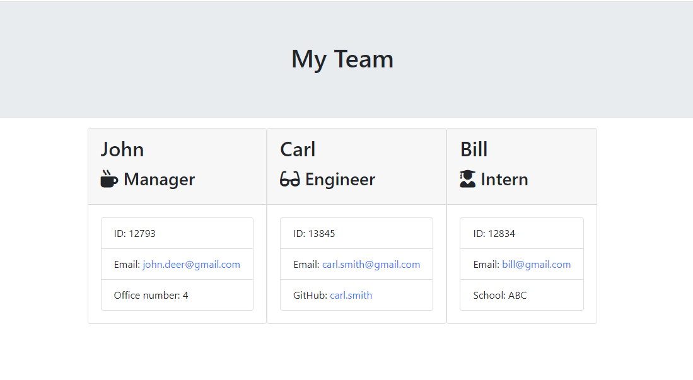

# Team-Profile-Generator

## Description
This project aims to take in information about employees on a software engineering team, then generate an HTML webpage that displays summaries for each person.

## Installation
N/A

## Usage

Open the downloaded repository using VS Code or your preferred terminal.
In the terminal, type the command node index.js to initiate the application.
Answer the questions prompted in the terminal.
Once you've completed all the prompts, the team.html file will be generated in output folder in the current directory.

The [URL](https://paulinasiwko.github.io/Team-Profile-Generator/) of deployed application.

## Credits
N/A

## Licence 
N/A